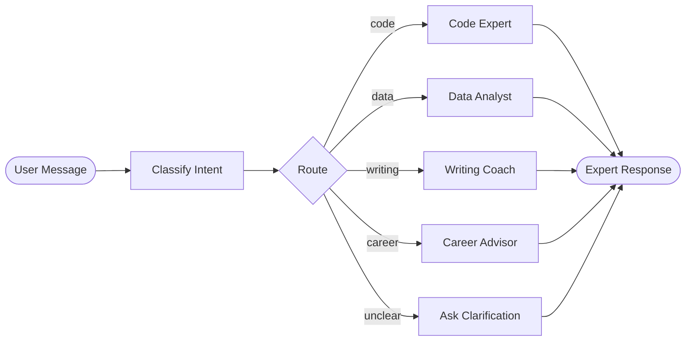

# Prompt Router

An AI-powered service that classifies user intent and routes requests to specialized expert personas for high-quality, context-aware responses.

Rather than using one giant prompt for everything, this system uses a two-step approach: **classify first, then respond** with a focused expert.

## How It Works



1. **Classify** — A lightweight LLM call detects the user's intent and returns a confidence score
2. **Route** — The intent label selects a specialized system prompt
3. **Respond** — A second LLM call generates the final answer using that expert persona

If the confidence is below 0.7 or the intent is unclear, the system asks a clarifying question instead of guessing.

## Quick Start

```bash
# Clone and enter the project
git clone <your-repo-url>
cd Prompt-Router

# Copy env file and add your API key
copy .env.example .env          # then edit .env

# Option A: Docker
docker compose up --build

# Option B: Local Python
python -m venv .venv
.venv\Scripts\activate
pip install -r requirements.txt
uvicorn app.main:app --reload
```

Open **http://localhost:8000** — you'll see the chat UI.

## Features

- **4 Expert Personas** — Code, Data, Writing, Career — each with a focused system prompt
- **Confidence Threshold** — Low-confidence classifications fall back to clarification
- **Manual Override** — Prefix with `@code`, `@data`, `@writing`, or `@career` to skip the classifier
- **JSONL Logging** — Every request is logged to `route_log.jsonl` for observability
- **Glassmorphism UI** — Clean, responsive chat interface with intent badges and confidence bars
- **Dockerized** — One command to build and run

## Project Structure

```
Prompt-Router/
├── app/
│   ├── __init__.py
│   ├── main.py          # FastAPI app & endpoints
│   ├── router.py         # classify_intent, route_and_respond
│   ├── prompts.py        # All system prompts (configurable)
│   ├── logger.py         # JSONL logging
│   └── static/
│       └── index.html    # Glassmorphism chat UI
├── tests/
│   └── test_router.py    # Automated test script (15+ messages)
├── docs/
│   ├── architecture.md   # System design & Mermaid diagrams
│   ├── api-reference.md  # Endpoint docs & log format
│   ├── setup.md          # Detailed setup instructions
│   └── testing.md        # Test messages & expected results
├── Dockerfile
├── docker-compose.yml
├── requirements.txt
├── .env.example
└── .gitignore
```

## Environment Variables

| Variable              | Required | Default          |
|-----------------------|----------|------------------|
| `OPENAI_API_KEY`      | Yes      | —                |
| `CLASSIFIER_MODEL`    | No       | `gpt-4o-mini`   |
| `GENERATOR_MODEL`     | No       | `gpt-4o-mini`   |
| `CONFIDENCE_THRESHOLD`| No       | `0.7`            |

## Docs

- [Architecture & Diagrams](docs/architecture.md)
- [API Reference](docs/api-reference.md)
- [Setup Guide](docs/setup.md)
- [Testing Guide](docs/testing.md)
