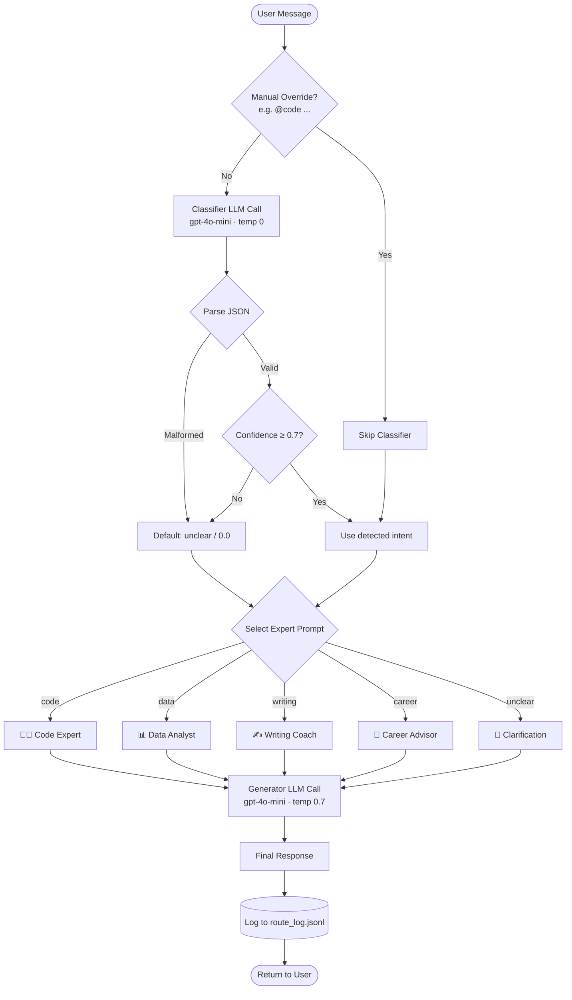
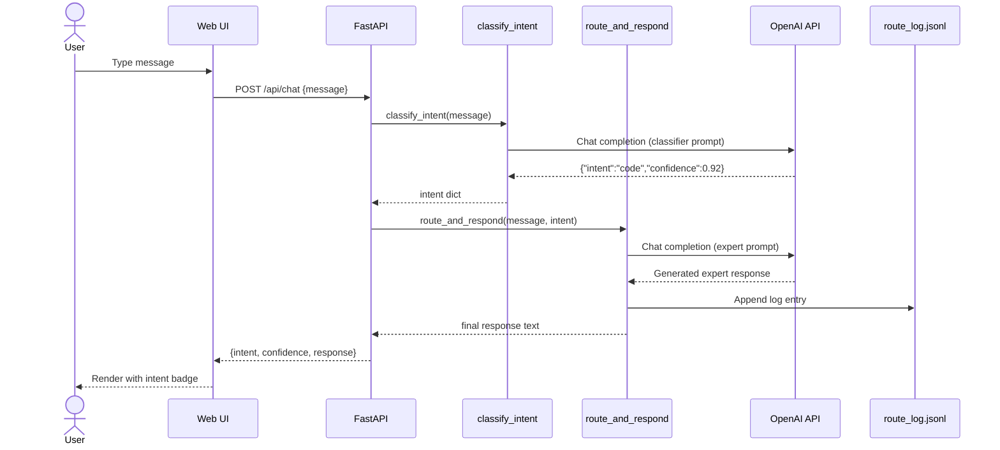

# Architecture Overview

How the Prompt Router works under the hood.

## High-Level Flow



## Component Diagram

```mermaid
graph LR
    subgraph Client
        UI[Web UI<br/>Glassmorphism SPA]
    end

    subgraph Server[FastAPI Server]
        API[/api/chat]
        RT[router.py<br/>classify_intent<br/>route_and_respond]
        PM[prompts.py<br/>Expert Prompts]
        LG[logger.py<br/>JSONL Logger]
    end

    subgraph External
        OAI[OpenAI API]
    end

    UI -->|POST /api/chat| API
    API --> RT
    RT --> PM
    RT -->|2 LLM calls| OAI
    RT --> LG
    LG -->|append| LOG[(route_log.jsonl)]
    API -->|JSON| UI
```

## Request Sequence


